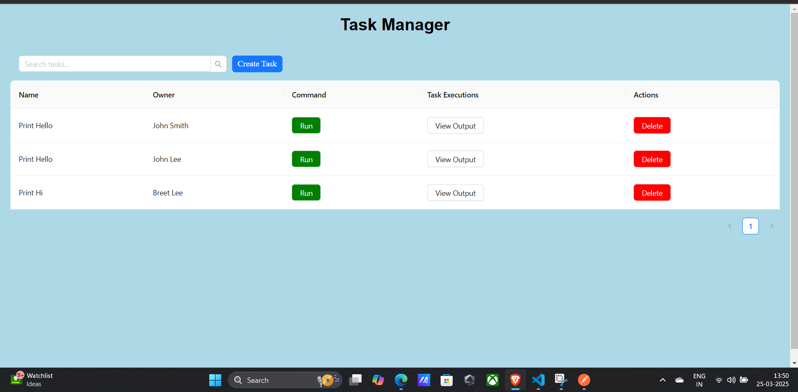
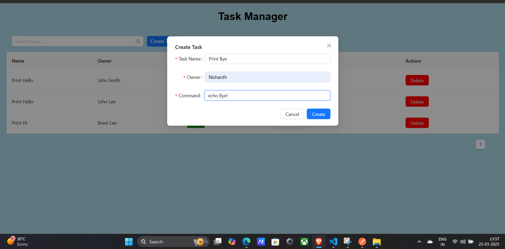
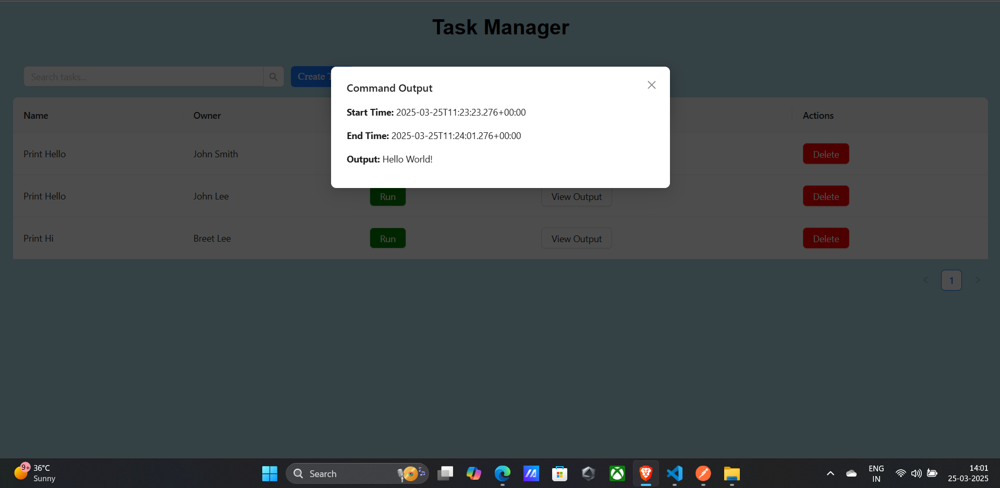

# Task Management Frontend

This repository contains the frontend implementation for Task Management application. The frontend is built using **React 19**, **TypeScript**, and **Ant Design** to provide a user-friendly interface for managing tasks.

## Features
- Create, search, and delete tasks
- Execute tasks and view command output
- Responsive and accessible UI
- Integration with the backend API

## Tech Stack
- **React 19**
- **TypeScript**
- **Ant Design**
- **Axios** (for API requests)

## Installation and Setup

### Prerequisites
- Node.js (v18+)
- npm or yarn installed
- Backend service running (Task 1)

### Steps to Run the Frontend
1. Clone the repository:
   ```sh
   git clone https://github.com/NishanthIlango/Task-manager-frontend.git
   cd frontend
   ```
2. Install dependencies:
   ```sh
   npm install
   ```
3. Configure the backend API URL:
   - Create a `.env` file in the root directory.
   - Add the following line:
     ```env
     VITE_API_BASE_URL=http://localhost:9000
     ```
4. Start the application:
   ```sh
   npm run dev
   ```
5. Open `http://localhost:3000` in your browser.

## API Integration
The frontend interacts with the backend using the following API endpoints:
- **GET** `/tasks` - Fetch all tasks
- **POST** `/tasks` - Create a task
- **DELETE** `/tasks/{id}` - Delete a task
- **POST** `/tasks/{id}/execute` - Execute a task

## Uploading Screenshots
To document your progress:
1. Capture UI screenshots showing features like task creation, execution, and deletion.
2. Save them in the `screenshots/` directory.
3. Reference them in this README:

   ## Screenshots
   - Task List View: 
   - Create Task List: 
   - Task Execution: 
---
